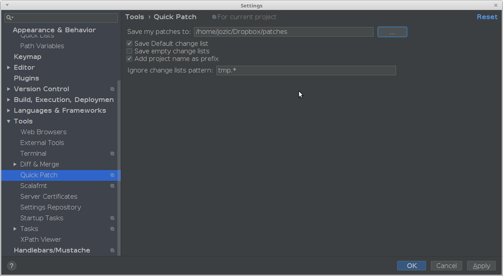

Quick Patch plugin
===========

Quick Patch is a plugin which allows you to save all the change lists you want as patches.

## Idea

The major use case is you have a project with some "ancient" vcs (like svn) where branching is painful and you have some unfinished work you want to:
 *  share it with someone
 *  finish it later and/or at some other place (home vs office)  
   
So in both cases you need to create a patch of what you have done so far.
It's pretty easy to do that in Intellij, but we can do better. Quick Patch will save all your changes at one click or a key stroke (there is one assigned by default, but you can change it).

When you want to continue your hacking, let's say at home, you need to move your patches somehow. Dropbox to the rescue! Quick patch idea works really nice with Dropbox (and friends).
You can set up plugin to save you patches into Dropbox directory and you are done! One key stroke and you ready to go, your patches are already waiting for you at home.

## Settings

To configure the plugin go to Settings -> Tools -> Quick Patch  

**Save my patches to** - select a directory where your patches should be stored. You will get a growl if you try to save patches without directory selected.  
**Save Default change list** - Mark it if you want to save "Default" changelist. Marked by default.  
**Save empty change lists** - Mark it if you want to save empty change lists as patch files. Unmarked by default.  
**Add project name as prefix** - Useful when you work on multiple projects and want to distinguish your patches later.  
**Ignore change lists pattern** - Type in a valid regex to ignore change lists you don't want to save. If the field is empty or regex isn't valid then this option will be ignored.

## Usage

When the plugin is installed you get an additional action on IDE's Changes panel. 
If you have at least one change list which satisfies your settings the action is enabled and you can click the icon or use associated shortcut to activate it. Voila, your patches are already in the specified folder.

## Change log

  * 0.1.1   
            - Update plugin descriptor so that it's available for all JetBrains products  
  * 0.1.0   
            - Support for IDEA 2018.1+  
  * 0.0.4   
            - Ignore change lists by pattern  
		    - Clean UI settings  
		    - Basic documentation added
  * 0.0.3  
		    - Support for IDEA 12 (Leda)  
		    - FileChooser for location field
  * 0.0.2   
		    - Bug fixes   
		    - Disable action if there is nothing to save
  * 0.0.1  
		    - Initial version - save patches to the specified directory
